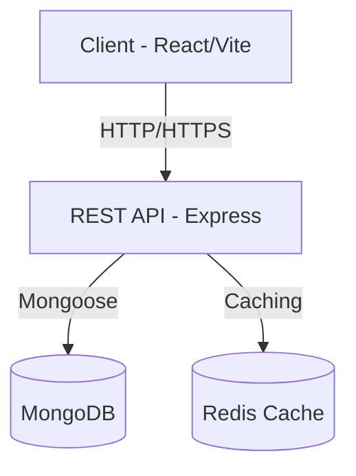

# Portfolio Gestore Accademico

[](https://nodejs.org)
[](https://reactjs.org)
[](https://opensource.org/licenses/ISC)
[](http://makeapullrequest.com)

> Sistema integrato per la gestione professionale di portfolio accademici, con supporto per articoli scientifici e citazioni bibliografiche.

## 📑 Sommario

- [Caratteristiche Principali](#-caratteristiche-principali)
- [Architettura](#-architettura)
- [Prerequisiti](#-prerequisiti)
- [Guida all'Installazione](#-guida-allinstallazione)
- [Sviluppo](#-sviluppo)
- [Testing](#-testing)
- [Deployment](#-deployment)
- [Documentazione API](#-documentazione-api)
- [Contributing](#-contributing)
- [Licenza](#-licenza)

## 🎯 Caratteristiche Principali

### Funzionalità Core
- **Gestione Articoli**
  - Creazione e modifica articoli con validazione avanzata
  - Supporto per metadata accademici
  - Sistema di categorizzazione flessibile

- **Gestione Citazioni**
  - Tracciamento automatico delle citazioni
  - Supporto per diversi stili bibliografici
  - Export in formati standard (BibTeX, EndNote)

### Caratteristiche Tecniche
- **Frontend**
  - UI Material Design responsive e accessibile
  - Gestione stato con React Query
  - Form validation integrata
  - Supporto offline e caching

- **Backend**
  - API RESTful con rate limiting
  - Validazione dati con Zod
  - Autenticazione JWT
  - Logging strutturato

## 🏗 Architettura



### Stack Tecnologico

#### Frontend
| Tecnologia | Versione | Scopo |
|------------|----------|--------|
| React | 19.x | Framework UI |
| Material-UI | 7.x | Design System |
| React Query | 5.x | Gestione Stato Server |
| Vite | 7.x | Build Tool |

#### Backend
| Tecnologia | Versione | Scopo |
|------------|----------|--------|
| Node.js | ≥18.x | Runtime |
| Express | 4.x | Framework API |
| MongoDB | 8.x | Database |
| Zod | 3.x | Validazione |

## � Prerequisiti

- Node.js >= 18.x
- MongoDB
- npm o yarn
- Git

## � Guida all'Installazione

### 1. Setup Ambiente
```bash
# Clona il repository
git clone https://github.com/[organizzazione]/portfolio-gestore.git
cd portfolio-gestore

# Installa husky per i git hooks (opzionale)
npx husky install
```

### 2. Configurazione Backend
```bash
cd server

# Installa le dipendenze
npm install

# Configura le variabili d'ambiente
cp .env.example .env
```

Configura le seguenti variabili in `.env`:
```env
NODE_ENV=development
PORT=3000
MONGODB_URI=mongodb://localhost:27017/portfolio
JWT_SECRET=your-secret-key
RATE_LIMIT_WINDOW=15
RATE_LIMIT_MAX=100
```

### 3. Setup Frontend
```bash
cd ../client/client

# Installa le dipendenze
npm install

# Verifica la configurazione
npm run lint
```

## � Sviluppo

### Avvio in Sviluppo
```bash
# Terminal 1 - Backend
cd server
npm run dev

# Terminal 2 - Frontend
cd client/client
npm run dev
```

### URL Sviluppo
- Frontend: http://localhost:5173
- API: http://localhost:3000
- Swagger UI: http://localhost:3000/api-docs

### Comandi Disponibili

#### Frontend
- `npm run dev` - Avvia server di sviluppo
- `npm run build` - Build di produzione
- `npm run preview` - Preview build
- `npm run lint` - Lint del codice
- `npm test` - Esegue i test

#### Backend
- `npm run dev` - Avvia con hot-reload
- `npm start` - Avvia in produzione
- `npm test` - Esegue i test
- `npm run test:watch` - Test in watch mode

## 🧪 Testing

### Strategia di Testing
- **Unit Test**: Componenti React, Utility, Helper
- **Integration Test**: API Endpoints, Database Operations
- **E2E Test**: Flussi utente completi

### Esecuzione Test
```bash
# Frontend Tests
cd client/client
npm test                 # Tutti i test
npm test -- --coverage  # Con coverage
npm test -- --watch    # Watch mode

# Backend Tests
cd server
npm test               # Tutti i test
npm run test:watch    # Watch mode
```

## 📦 Deployment

### Build di Produzione
```bash
# Build Frontend
cd client/client
npm run build

# Preparazione Backend
cd ../../server
npm ci --production
```

### Configurazione Production
- Impostare `NODE_ENV=production`
- Configurare CORS appropriatamente
- Attivare compressione GZIP/Brotli
- Configurare rate limiting
- Impostare cache headers

## 📚 Documentazione API

La documentazione OpenAPI/Swagger è disponibile su:
- Sviluppo: http://localhost:3000/api-docs
- Produzione: https://api.example.com/api-docs

### Endpoint Principali

| Metodo | Endpoint | Descrizione |
|--------|----------|-------------|
| GET | /api/articles | Lista articoli |
| POST | /api/articles | Crea articolo |
| GET | /api/citations | Lista citazioni |
| POST | /api/citations | Crea citazione |

## 🤝 Contributing

Leggi [CONTRIBUTING.md](CONTRIBUTING.md) per dettagli su:
- Processo per le Pull Request
- Convenzioni di codifica
- Setup ambiente di sviluppo
- Esecuzione dei test

### Workflow Git
1. Fork del repository
2. Crea un branch (`git checkout -b feature/nome-feature`)
3. Commit con [Conventional Commits](https://www.conventionalcommits.org/)
4. Push al branch (`git push origin feature/nome-feature`)
5. Apri una Pull Request

## 📄 Licenza

Copyright © 2025

Distribuito sotto licenza ISC. Vedi [LICENSE](LICENSE) per maggiori informazioni.

## 👥 Mantenitori

- [Nome Mantenitore](https://github.com/Giampiero1998)


**[⬆ Torna su](#portfolio-gestore-accademico)**

Fatto con ❤️ da Giampiero

</div>